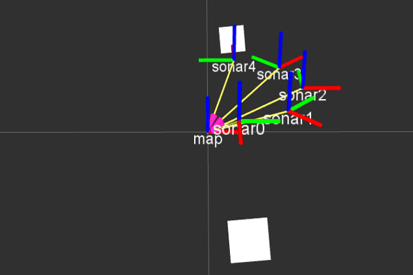
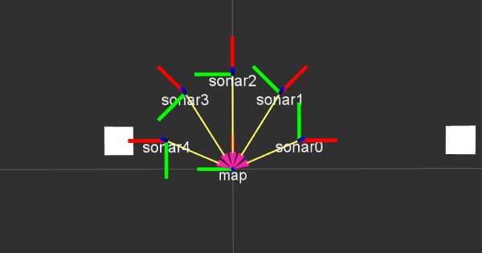

# sensor_pointcloud
Convert range data from ultrasound/lidar topics (`sensor_msgs::Range`) to pointclouds (`sensor_msgs::PointCloud2`)

## Installation
#### Using catkin_make
1. Change directory to your catkin workspace source directory
  `cd ~/catkin_ws/src`
2. Clone the repository to your catkin workspace
```
git clone https://github.com/eliotlim/sensor_pointcloud
```
3. Build the package from source by performing `catkin_make`
---
## Usage
#### roslaunch
1. Execute `roslaunch sensor_pointcloud sensor_pointcloud.launch`
  - This will load `sensor_pointcloud/sensorConfig.yaml` into the node namespace by default.

#### rosrun
1. Load ros parameters using `rosparam`
2. Call `rosrun sensor_pointcloud sensor_pointcloud_node`

#### How to use sensorConfig.yaml
Please refer to [this guide](sensorConfig.md) for details.

---
## Results

Launching the node using roslaunch with the default `sensorConfig.yaml`
will give you the following transform tree.
 
---
## Miscellaneous
---
#### License
This library is licensed under the MIT License.
